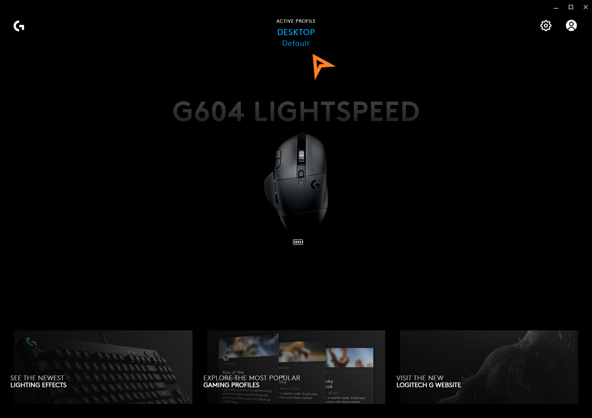
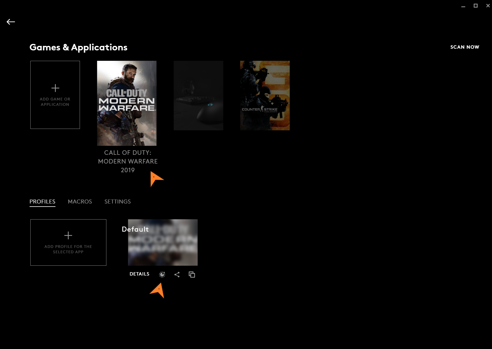
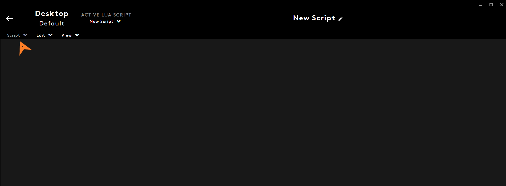
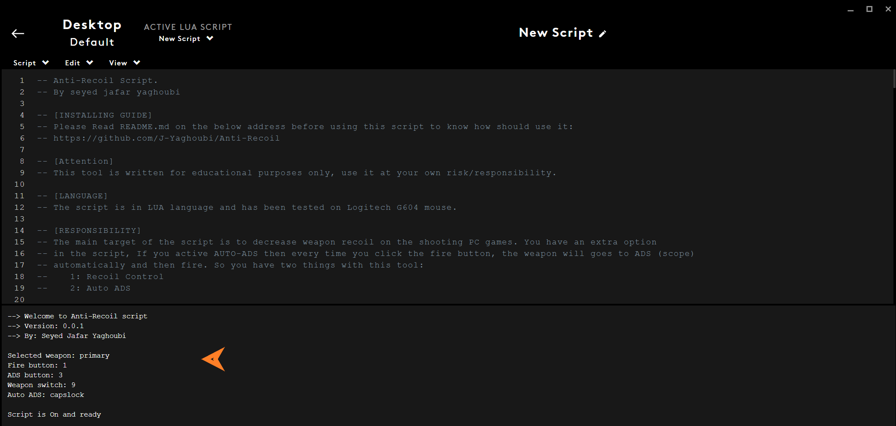

# Anti-Recoil
Logitech mouse Anti-recoil script for shooting games like Warzone and Battlefield

## Requirements:
To use this script you need to have Logitech G-Hub software installed on your pc and a Logitech mouse that supports the scripting.
You can download Logitech G-Hub software from here:    
https://www.logitechg.com/en-us/innovation/g-hub.html

## Installing:   
After installing G-Hub you should follow this guide to active Anti-Recoil script on your favorite profile:         
1- Open Logitech G-Hub software    
2- Click on the this section as shown in the picture below     

3- Select the application that you want to active script on it and then click on scripting     

4- Go to script menu and then import Anti-Recoil.lua   

5- Go to script menu again and then click on Save and Run    
6- If everything is ok you should see a welcome message on console  

## Settings:   
The script has some simple setting that has been explained in code. So read it to get the necessary information.
